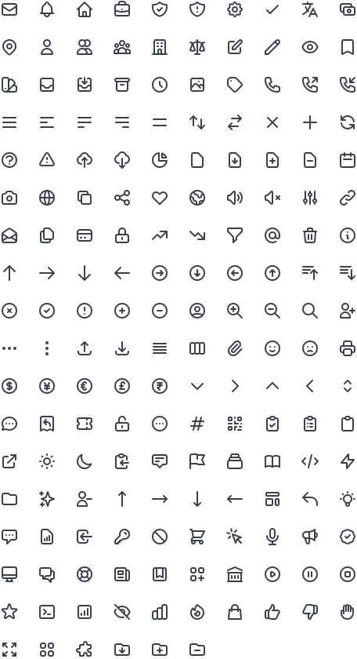
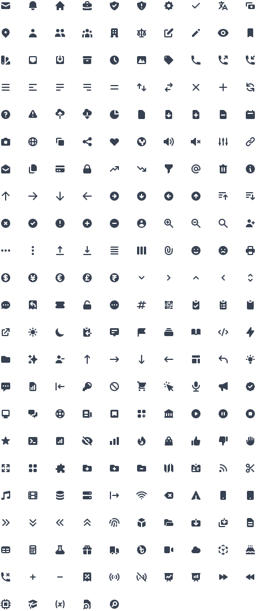

# Heroicons

A set of free MIT-licensed high-quality SVG icons for you to use in your web projects.

224 icons per style currently, more to come in the future.

[Preview and search at Heroicons.com](https://heroicons.com)

### Outline style

24x24 icons drawn with a stroke.



### Solid style

Smaller 20x20 icons drawn with fills.



### Usage

To use these icons, simply copy the source for the icon you need from [heroicons.com](https://heroicons.com) and inline it directly into your HTML:

```html
<svg class="h-6 w-6 text-gray-500" fill="none" viewBox="0 0 24 24" stroke="currentColor">
  <path
    stroke-linecap="round"
    stroke-linejoin="round"
    stroke-width="2"
    d="M12 8v4l3 3m6-3a9 9 0 11-18 0 9 9 0 0118 0z"
  />
</svg>
```

Both icon styles are preconfigured to be stylable by setting the `color` CSS property, either manually or using utility classes like `text-gray-500` in a framework like [Tailwind CSS](https://tailwindcss.com).

We also publish the icons to npm as `heroicons`, but we don't consider the directory structure stable yet and it could change in any release, so use the npm package at your own risk right now.

## Use our icons as React's components

First, install the dependencies. ```npm install```.

To create the React's components. Run:
```bash
node ./scripts/build-react-icons.js
```
That would create two folders in `./react-icons/`. The folder `outline` for the outline icons, and `solid` folder for the solid ones. Inside you may find `*.js` files.

If you use `Typescript`. You can get them by running:
```bash
node ./scripts/build-react-icons.js tsx=true
```

You can delete those `*.js` or `*.tsx` files by running:
```bash
node ./scripts/delete-react-icons.js
```