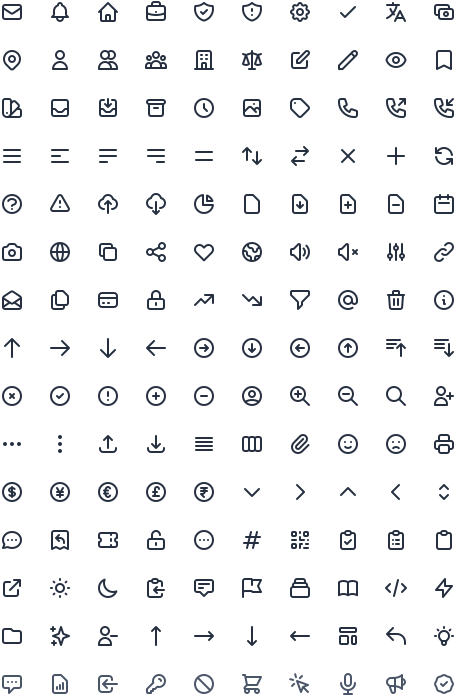
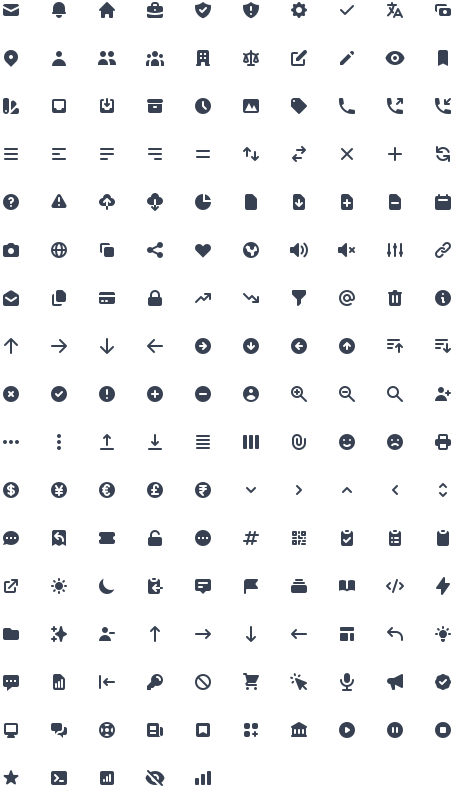

# Heroicons

A set of free MIT-licensed high-quality SVG icons for you to use in your web projects.

140 icons per style currently, more to come in the future.

[Preview and search at Heroicons.dev](https://heroicons.dev) _(Made by @codex-zaydek)_

### Outline style

24x24 icons drawn with a stroke.



### Solid style

Smaller 20x20 icons drawn with fills.



### Usage _(in HTML)_

To use these icons, simply copy the source for the icon you need and inline it directly into your HTML:

```html
<svg
  class="h-6 w-6 text-gray-500"
  fill="none"
  viewBox="0 0 24 24"
  stroke="currentColor"
>
  <path
    stroke-linecap="round"
    stroke-linejoin="round"
    stroke-width="2"
    d="M12 8v4l3 3m6-3a9 9 0 11-18 0 9 9 0 0118 0z"
  />
</svg>
```

Both icon styles are preconfigured to be stylable by setting the `color` CSS property, either manually or using utility classes like `text-gray-500` in a framework like [Tailwind CSS](https://tailwindcss.com).


### Usage _(in Affinity Designer)_
To use these icons as an asset in Affinity Designer, 
1. Download [icons-ad.afassets](src/asset/icons-ad.afassets) in the src directory, and
2. Import the file through the Assets Panel in Affinity Designer